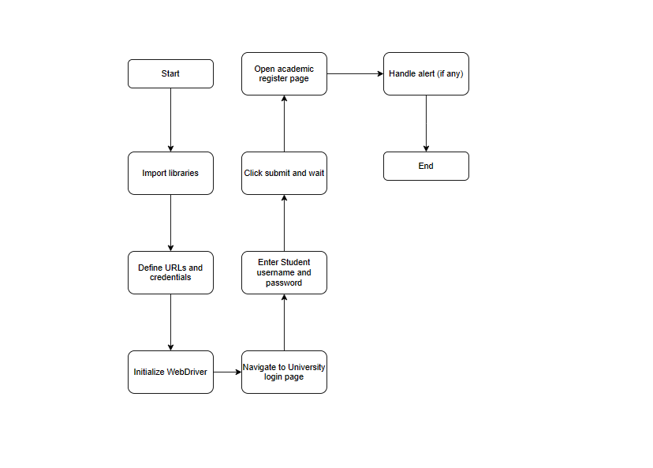

# Selenium Attendance Record
Selenium Bot for Automatic Student Attendance Record

## Description
This project includes a Python script that automates interactions with a college website to get student attendance record. It uses libraries such as `requests`, `BeautifulSoup`, and `selenium` to navigate and interact with web pages.

## Features
1. **Automated Web Interaction:** Utilizes Selenium WebDriver for automating web navigation and interaction.
2. **Login Automation:** Automates the login process to a specific URL (https://webprosindia.com/hitam).
3. **Attendance Record Access:** Automatically navigates to the attendance record page after login.
4. **Alert Handling:** Manages and dismisses web-based alerts during navigation.
5. **Timed Waits:** Includes explicit waiting mechanisms to ensure that web pages are fully loaded before proceeding.

## Requirements
- Python 3
- Libraries: `requests`, `BeautifulSoup`, `selenium`

## Usage
Run `main.py` to start the script. Ensure that all the necessary Python libraries are installed.

## Disclaimer
This project is for educational purposes. Ensure you have the right to access and automate interactions with the targeted website.
